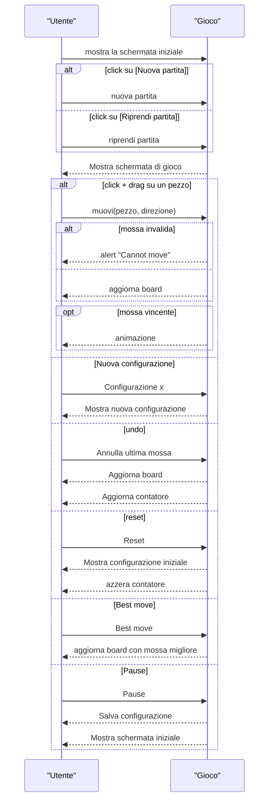
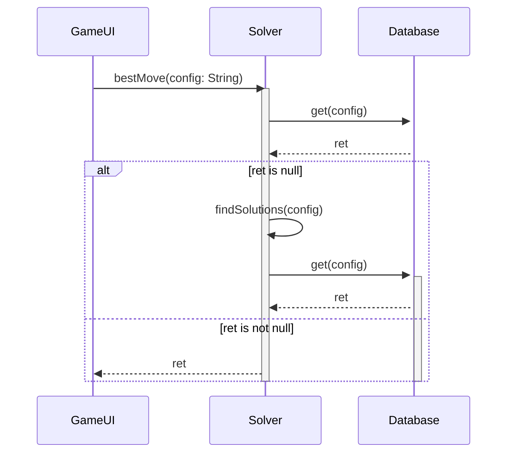
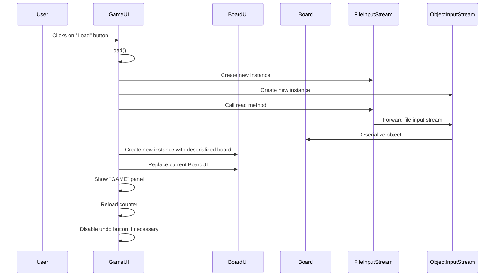
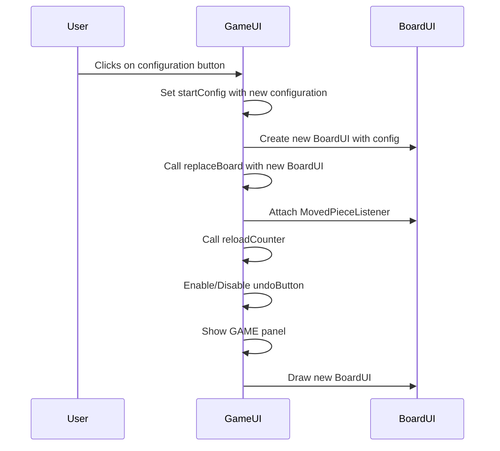
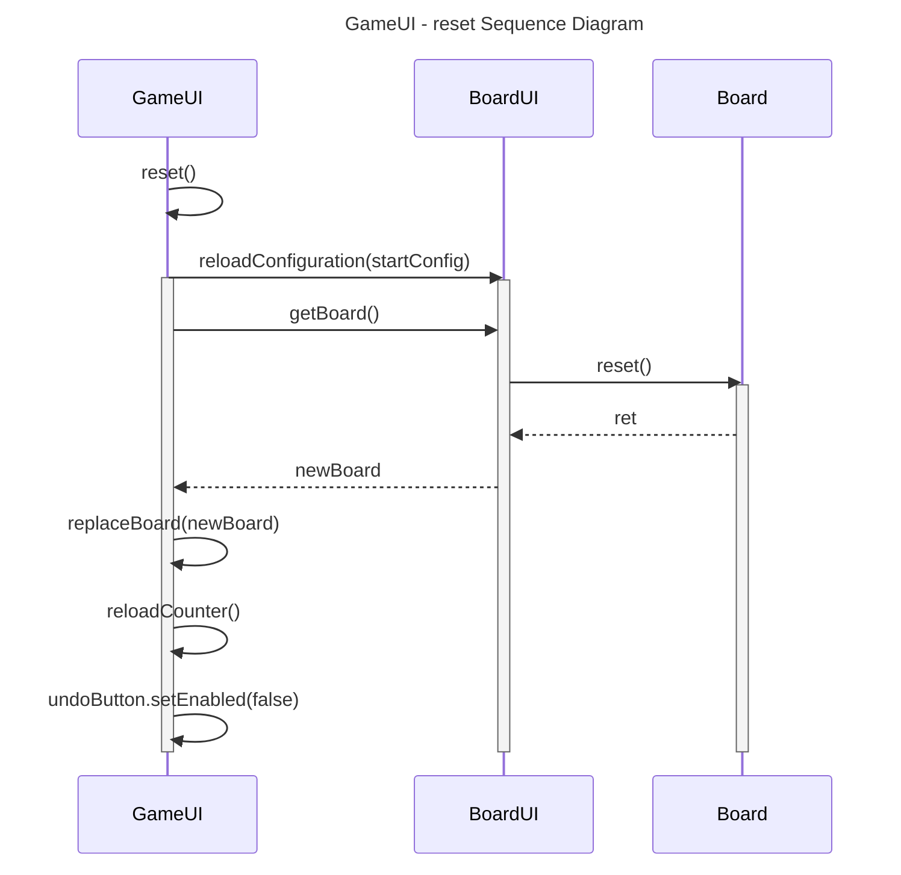
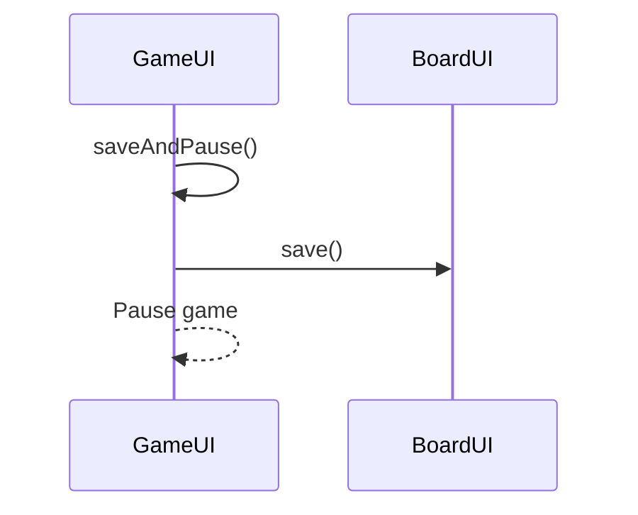
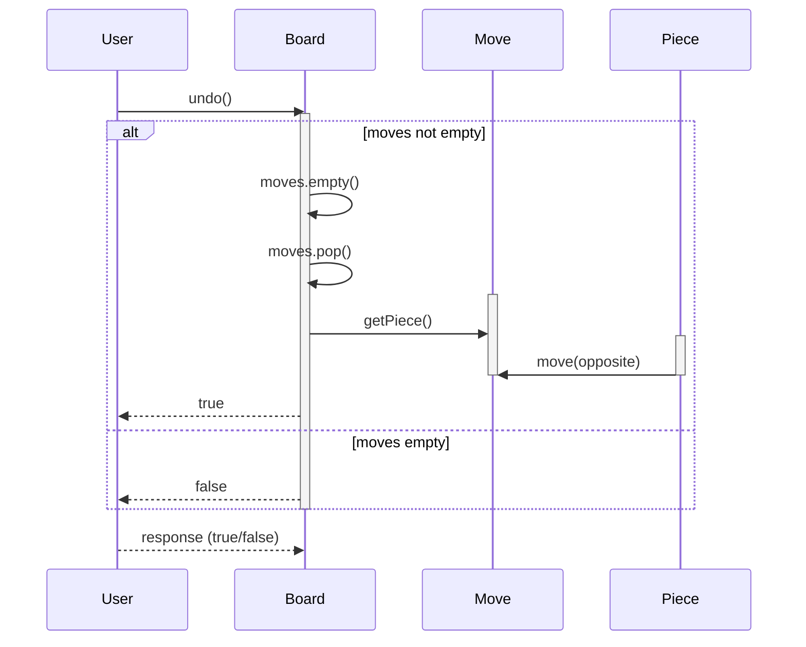

## Progetto di Elementi di Ingegneria del Software
-----------------------------------------------------
devi.danese@studenti.unipd.it
fabio.pasta@studenti.unipd.it
ludovico.speranza@studenti.unipd.it
davide.calo@studenti.unipd.it

- [devi.danese@studenti.unipd.it](mailto:devi.danese@studenti.unipd.it)
- [davide.calo@studenti.unipd.it](mailto:davide.calo@studenti.unipd.it)
- [ludovico.speranza@studenti.unipd.it](mailto:ludovico.speranza@studenti.unipd.it)
- [fabio.pasta@studenti.unipd.it](mailto:fabio.pasta@studenti.unipd.it)

# **Manuale di Gioco - Klotski**

Benvenuto nel manuale di Klotski, un intrigante gioco di logica e strategia! Klotski è un gioco di puzzle in cui l'obiettivo principale è spostare le pedine all'interno di una scacchiera al fine di liberare una pedina specifica. Questo manuale ti guiderà attraverso le regole del gioco, l'obiettivo, le pedine e le strategie di gioco.

### **Obiettivo del Gioco**

L'obiettivo di Klotski è liberare una pedina specifica, in particolare quella quadrata di colore rosso,  spostando le altre pedine sulla scacchiera. Questa pedina si trova all'interno di una struttura composta da altre pedine, devi trovare il modo di spostare le pedine ostacolanti in modo tale da creare un percorso libero per portarla fino all'uscita della scacchiera.

### **Le Pedine**

Nel gioco Klotski, ci sono diverse pedine, ognuna con una forma e una dimensione specifica. Le pedine possono essere di diversi tipi, ad esempio:

- Pedina quadrata: Ne abbiamo di due tipi, quadrata piccola e quadrata grande, la prima occupa un solo spazio nella scacchiera, mentre la seconda ne occupa 4 ed è proprio quest’ultima che dovrai far uscire dalla griglia.
- Pedina rettangolare: Questa pedina è di forma rettangolare e occupa due spazi adiacenti nella scacchiera, in orizzontale o verticale.

Le pedine possono essere spostate solo in orizzontale o in verticale solo però negli spazi vuoti. Non è possibile spostare le pedine diagonalmente.

### **La Scacchiera**

Il gioco Klotski viene giocato su una scacchiera rettangolare 5x4. Ogni casella della scacchiera può ospitare una sola pedina alla volta. Alcune caselle sono occupate da pedine all'inizio del gioco, creando una configurazione iniziale. Devi utilizzare queste pedine per spostare il quadrato grande rosso verso l'uscita in basso alla scacchiera. Per muovere una pedina dovrai selezionarla con la freccetta del mouse e trascinarla nella direzione desiderata.

### **Regole di Movimento**

Le regole di movimento nel gioco Klotski sono relativamente semplici:

- Puoi spostare una pedina solo se c'è spazio libero nella direzione in cui desideri spostarla.
- Non puoi sovrapporre o saltare pedine durante il movimento. Solo un'intera pedina può essere spostata alla volta.
- Le pedine possono essere spostate solo in orizzontale o in verticale, di una posizione alla volta.

Tieni presente che le pedine possono essere bloccate o intrappolate in determinate configurazioni. Potrebbe essere necessario pianificare attentamente i tuoi movimenti per liberare le pedine bloccate e raggiungere l'obiettivo del gioco.

### **Strategie di Gioco**

Ecco alcune strategie utili per affrontare i puzzle di Klotski:

- Esplora le possibilità: Esamina attentamente la configurazione iniziale della scacchiera e prova diverse combinazioni di spostamenti per liberare il quadrato grande rosso. Potresti dover tornare indietro e riprovare alcune mosse per trovare la soluzione migliore.
- Muovi le pedine più grandi per prime: Spesso, spostare le pedine più grandi può aprirti la strada per liberare le pedine più piccole. Concentrati sul liberare spazio per il quadrato grande rosso.
- Considera le conseguenze a lungo termine: Prima di fare una mossa, pensa alle possibili conseguenze future. Spostare una pedina potrebbe liberare uno spazio per un'altra pedina, ma potrebbe anche bloccare altre pedine. Pianifica con attenzione per evitare di raggiungere configurazioni di blocco.

Ricorda che Klotski è un gioco di logica e strategia che richiede pazienza e pensiero critico. Non scoraggiarti se incontri ostacoli lungo il percorso. Continua a esplorare diverse strategie e tieni presente che la pratica porterà alla perfezione.

Buon divertimento e buona risoluzione dei puzzle di Klotski!

# Progetto

[Tecnologie utilizzate](https://www.notion.so/6679b2c3262642769b762de11fb3def0?pvs=21)

### **Descrizione del Progetto**

Klotski è un'applicazione software che permette di giocare al famoso gioco di puzzle Klotski sul tuo computer. Il gioco Klotski consiste nel liberare una pedina specifica, spostando le altre pedine sulla scacchiera. L'obiettivo è trovare la sequenza di mosse corretta per liberare il quadrato grande e rosso.

### **Installazione e Avvio**

Per installare e avviare l'applicazione Klotski, segui i seguenti passaggi:

- Requisiti di sistema:
    - Assicurati di avere installato Java Development Kit (JDK) versione 17 o successiva sul tuo computer.
- Download del codice sorgente:
    - Apri questo [progetto github](https://github.com/lvdoviko/progetto-ottimizzato-) per scaricare la repository da avviare con il tuo IDE.
    - Se vuoi compilare da IDE, attendi che Maven scarichi le dipendenze necessarie (Junit)
- Avvio da Windows senza scaricare il repository:
    - Scarica questo [jar file](https://github.com/lvdoviko/progetto-ottimizzato-/blob/main/bin/klotski.jar?raw=true).
    - Dopo il download, puoi avviare l'applicazione Klotski facendo doppio clic sull'icona del file jar.
- Installazione per MacOS senza scaricare repository:
    - Scarica questo [jar file](https://github.com/lvdoviko/progetto-ottimizzato-/blob/main/bin/klotski.jar?raw=true).
    - Dopo il download, puoi avviare l'applicazione Klotski facendo doppio clic sull'icona dell'applicazione.

      Nel caso in cui dovesse apparire il messaggio “Impossibile aprire edids.jar perché proviene da uno sviluppatore non identificato.” procedi cliccando sopra il file “edids.jar” tenendo premuto il tasto Ctrl (“control”). In seguito verrà aperta una finestra con scritto “macOS non può verificare lo sviluppatore di edids.jar. Confermi di volerlo aprire?”, a questo punto clicca su “Apri”. Puoi aprire l'app in futuro semplicemente facendo doppio clic su di essa, poiché è stata contrassegnata come un'eccezione alle impostazioni sulla sicurezza, simile a un'app autorizzata.

### **Ambienti di Esecuzione e Vincoli**

Klotski è stato sviluppato utilizzando Java e può essere eseguito su piattaforme compatibili con Java, tra cui Windows, macOS e Linux.

Per eseguire correttamente l'applicazione Klotski, è necessario avere installato Java Development Kit (JDK) versione 17 o successiva. Verifica la versione di Java installata sul tuo sistema utilizzando il comando java -version dal terminale o prompt dei comandi. Se la versione di Java non è compatibile, è consigliato aggiornare alla versione corretta dal sito ufficiale di java prima di avviare l'applicazione Klotski.

### **Librerie Riutilizzate**

Nel progetto di Klotski, sono state utilizzate alcune librerie per semplificare lo sviluppo dell'applicazione. Le librerie riutilizzate includono:

- Java Swing: Klotski utilizza Java Swing per la creazione dell'interfaccia grafica del gioco. Java Swing offre un insieme di componenti e strumenti per la creazione di interfacce utente interattive e moderne. Come gruppo, abbiamo scelto di utilizzare Java Swing per il nostro progetto poiché ci ha permesso di portare valore al termine di ogni sprint, sfruttando la nostra conoscenza pregressa di tale tecnologia.
- JUnit: Per garantire la qualità del codice e facilitare i test automatizzati, Klotski utilizza JUnit, un framework di test unitari per Java. JUnit consente di scrivere e eseguire test per verificare il corretto funzionamento delle varie componenti del gioco.

È importante notare che Klotski fa uso di queste librerie per migliorare l'efficienza dello sviluppo e fornire una migliore esperienza utente. Tuttavia, durante l'installazione dell'applicazione Klotski, le librerie necessarie verranno automaticamente incluse nel pacchetto di installazione, pertanto non è necessario preoccuparsi di installarle separatamente.

### Configurazioni di partenza

Sono presenti 4 bottoni contenenti 4 diverse configurazioni iniziali di gioco le quali sono state caricate in maniera statica all’interno del codice e non vengono dunque generate in maniera randomica dal programma, inoltre il cambio di configurazione comporta un conseguente azzeramento delle mosse.

### Reset

Con il pulsante reset è possibile tornare indietro alla configurazione iniziale scelta con il conseguente azzeramento delle mosse.

### Back (UNDO)

Attraverso l’apposito pulsante, è possibile l'annullamento di una mossa effettuata, grazie a un meccanismo che comporta la rimozione della configurazione più recente dalla cronologia e la successiva visualizzazione di quella precedente.

### Best move

Tramite l’apposito bottone, è possibile fare eseguire al gioco la miglior mossa possibile partendo dallo stato in cui si trova la partita. La classe `Solver` implementa un algoritmo per risolvere il gioco Klotski. Il metodo `bestMove` restituisce la migliore mossa per una configurazione di gioco fornita. Se la mappa `db` non contiene la mossa per la configurazione, viene chiamato il metodo `findSolutions`, per cercare le soluzioni, il quale esplora le diverse configurazioni di gioco, cercando di trovare mosse vincenti che vengono successivamente memorizzate nella mappa `db`.

### Metti in pausa

Tramite il bottone “Metti in pausa”, lo stato corrente del gioco viene salvato in un file `salvataggio.klotski` e l’utente viene reindirizzato nella home iniziale dove può scegliere se riprendere la partita appena interrotta o iniziarne una nuova.

### Riprendi partita

Possibilità di caricare lo stato di gioco precedentemente salvato. Vengono ricaricati i dati della partita presenti nel `salvataggio.klotski` in seguito all’esecuzione del pulsante “Metti in pausa”.

### Counter delle mosse effettuate

E’ presente un "counter" per il conteggio delle mosse di una partita, il quale corrisponde alla dimensione dello storico senza tenere conto della configurazione iniziale (segue questa logica per tutte le altre funzionalità).

# Design Patterns

# GRASP

### ***Controller***

La classe `GameUI` è stata progettata seguendo il design pattern Controller. La classe `GameUI` stessa funge da controller ossia un oggetto che si occupa della comunicazione tra interfaccia grafica e sistema.

Implementa l'interfaccia `ActionListener` per gestire gli eventi generati dagli elementi UI, come i clic sui pulsanti.

I metodi di gestione degli eventi, come `actionPerformed`, sono responsabili di interpretare le azioni dell'utente e agire di conseguenza.

Ad esempio, quando l'utente fa clic su un pulsante, il controller avvia azioni come la selezione di una configurazione, l'esecuzione di una mossa o il salvataggio del gioco.

***High Cohesion***

Le classi nel software sono state progettate con un'attenzione particolare per rappresentare in modo accurato concetti distinti e indipendenti.

# GoF

### *Observer*

La classe `Piece` è stata realizzata utilizzando il design pattern `Observer`, in quanto i listener vengono aggiunti tramite il metodo `addMovedPieceListener()`, che registra un oggetto `MovedPieceListener` interessato agli eventi di spostamento delle pedine. Quando un evento di spostamento si verifica, il metodo `fireMovedPieceEvent()` viene chiamato per notificare tutti i listener registrati, chiamando il metodo `pieceMoved()` su ciascun listener. Questo permette agli oggetti esterni interessati di essere informati sugli spostamenti delle pedine e intraprendere eventuali azioni necessarie.

Quindi, la classe `Piece` utilizza il design pattern `Observer` per implementare la notifica degli eventi di spostamento delle pedine ai listener registrati.

### *Composite*

La classe `PieceUI` estende la classe `JButton` e implementa l'interfaccia `MouseListener` e `MovedPieceListener`. Questo suggerisce l'utilizzo del pattern Composite, in cui gli oggetti possono essere trattati come alberi, e le classi componenti (come `PieceUI`) possono avere componenti figlio (ad esempio, un pulsante può contenere un'immagine).

# SPECIFICHE

[USE CASE 1](https://www.notion.so/c948e01d63494d689ce3c3d1bd799ed6?pvs=21)

[USE CASE 2](https://www.notion.so/7f74f7cebd6a4b4287d0acad2a186149?pvs=21)

[USE CASE 3](https://www.notion.so/bbc859fd71fa46f5b96a9eaab0e87ba3?pvs=21)

[USE CASE 4](https://www.notion.so/45a2f4072c734aa3a17d8e3a9f9c6948?pvs=21)

[USE CASE 5](https://www.notion.so/05d39810a965460abcc9bde45c877f45?pvs=21)

[USE CASE 6](https://www.notion.so/efd0addf18314237a29e31796e4bb847?pvs=21)

[USE CASE 7](https://www.notion.so/bb556fc303a94630b587801eeb0d8e92?pvs=21)

[USE CASE 8](https://www.notion.so/8583e5208ac24ff89abb22475796bf21?pvs=21)

# DESIGN

- Domain Model

- Design Class Model

# SEQUENCE DIAGRAM

- **System sequence diagram**

- **Internal sequence diagram**

  ***bestMove()***

     ***load()***

     ***reloadConfiguration()***

     ***reset()***

     ***saveAndPause()***

     ***undo()***

# System Test Reports

Tutti i System test sono stati effettuati con Sistema operativo: Windows 10, MacOS Monteray 12.1

***1. Avvio del gioco***

| Summary | Verificare che il gioco klotski si avvii correttamente utilizzando la configurazione iniziale prevista |
| --- | --- |
| Test Case Design | - Test di avvio del gioco senza errori
- Test di verifica della corretta configurazione iniziale |
| Pre-Condition | - Il sistema è stato correttamente installato e configurato.
- La configurazione iniziale del gioco klotski è stata impostata correttamente. |
| Post-Condition | Il gioco klotski si avvia senza errori utilizzando la configurazione iniziale prevista. |
| Test Scripts | Test di avvio del gioco senza errori:
        Aprire l'applicazione del gioco klotski.
        Fare clic sul pulsante "Nuova partita".
        Verificare che il gioco si avvii senza errori e la schermata di gioco venga visualizzata correttamente.

Test di verifica della corretta configurazione iniziale:
Aprire l'applicazione del gioco klotski.
Verificare che la configurazione iniziale del gioco, compresi i pezzi e la loro posizione, corrisponda alla configurazione prevista. |
| Test Case Execution Reports: | Test di avvio del gioco senza errori: ✅Passato
Test di verifica della corretta configurazione iniziale: ✅Passato |

***2. Scelta configurazione***

| Summary | Verificare che l'utente possa selezionare correttamente la configurazione iniziale desiderata per il gioco Klotski |
| --- | --- |
| Test Case Design | - Test di selezione della configurazione 1
- Test di selezione della configurazione 2
- Test di selezione della configurazione 3
- Test di selezione della configurazione 4 |
  | Pre-Condition | Il sistema è stato correttamente avviato ed è stato scelto “Nuova partita” |
  | Post-Condition | La configurazione iniziale selezionata dall'utente viene applicata correttamente al gioco klotski. |
  | Test Scripts | Test di selezione di una configurazione iniziale valida:
  Aprire l'applicazione del gioco klotski.
  Scegliere nuova partita.
  Selezionare una configurazione iniziale valida tra quelle disponibili a sinistra.
  Verificare che la configurazione selezionata venga applicata correttamente al gioco klotski. |
  | Test Case Execution Reports: | Di seguito sono riportati i risultati dell'esecuzione dei test case:
- Test di selezione della configurazione 1: ✅Passato
- Test di selezione della configurazione 2: ✅Passato
- Test di selezione della configurazione 3: ✅Passato
- Test di selezione della configurazione 4: ✅Passato  |

***3. Gioca***

| Summary | Verificare che la funzione di gioca consenta al giocatore di muovere i pezzi sulla board rispettando le regole di non uscita dalla board e di non sovrapporre i pezzi. |
| --- | --- |
| Test Case Design | - Test di movimento valido di un pezzo all'interno della board
- Test di movimento che porta il pezzo fuori dalla board
- Test di sovrapposizione tra pezzi |
  | Pre-Condition | Il sistema è stato correttamente avviato ed è stato scelto “Nuova partita” |
  | Post-Condition | Dopo il movimento dei pezzi, la board si trova in uno stato valido, senza pezzi sovrapposti e senza pezzi fuori dalla board. |
  | Test Scripts | Test di movimento valido di un pezzo all'interno della board:
  Avviare una partita nel gioco klotski, quindi scegliere “Nuova partita”
  Scegliere un pezzo valido e una direzione di movimento valida.
  Effettuare il movimento del pezzo.
  Verificare che il pezzo si sia spostato correttamente nella nuova posizione.

Test di movimento che porta il pezzo fuori dalla board:
Continuare il test di prima
Scegliere un pezzo valido e una direzione di movimento che porti il pezzo fuori dalla board.
Verificare che il movimento non venga eseguito e che il pezzo rimanga nella posizione originale.

Test di sovrapposizione tra pezzi:
Continuare il test di prima
Scegliere un pezzo e muoverlo verso un altro pezzo
Verificare che il movimento non venga eseguito e che il pezzo rimanga nella posizione originale. |
| Test Case Execution Reports: | Test di movimento valido di un pezzo all'interno della board: ✅Passato
Test di movimento che porta il pezzo fuori dalla board: ✅Passato
Test di sovrapposizione tra pezzi: ✅Passato  |

***4. Vincita***

| Summary | Verificare che quando il pezzo 2x2 raggiunge la posizione in basso in centro viene visualizzato il messaggio di partita vinta.
Il click sulla schermata di vittoria riapre la schermata di avvio gioco. |
| --- | --- |
| Test Case Design | - Test vincita
- Test riavvio. |
  | Pre-Condition | - Il gioco Klotski è in esecuzione su una nuova partita
- Il giocatore ha completato con successo tutte le mosse necessarie per raggiungere la condizione di vittoria. |
  | Post-Condition | - L'animazione di fuochi d'artificio con il messaggio "YOU WIN” viene avviata correttamente. |
  | Test Scripts | 1. Avviare il gioco Klotski.
2. Effettuare tutte le mosse necessarie per raggiungere la condizione di vittoria.
3. Verificare che la schermata di fine gioco venga visualizzata correttamente con il messaggio "Hai vinto!".
4. Verificare che l'animazione di fuochi d'artificio venga avviata correttamente. |
   | Test Case Execution Reports: | - Test vincita: ✅Passato
- Test riavvio: ✅Passato |

***5. Back (UNDO)***

| Summary | Verificare che la pressione del tasto "Back" annulla l’ultima mossa del gioco. |
| --- | --- |
| Test Case Design | - Test Undo senza aver effettuato mosse
- Test Undo senza dopo effettuato mosse |
| Pre-Condition | Il gioco Klotski è in esecuzione su una nuova partita |
| Post-Condition | Dopo l'annullamento delle mosse, lo stato del gioco Klotski deve tornare al momento immediatamente precedente all'ultima mossa effettuata. Se eseguito l’undo, il contatore deve diminuire di una mossa. |
| Test Scripts | - Test Undo senza aver effettuato mosse:
        Avviare una partita nel gioco klotski, quindi scegliere “Nuova partita”
        Premere il pulsante Back
        Verificare che non viene mosso alcun pezzo

- Test Undo senza dopo effettuato mosse:
  Continuare la partita precedente
  Effettuare una mossa
  Premere il pulsante Back
  Verificare che il pezzo torna alla posizione precedente
  Verificare che il contatore diminuisce di uno |
  | Test Case Execution Reports: | - Test Undo senza aver effettuato mosse: ✅Passato
- Test Undo senza dopo effettuato mosse: ✅Passato |

***6. Reset***

| Summary | Verificare se la funzionalità di reset del gioco Klotski funziona correttamente.
Il gioco deve riavviarsi con l’ultima configurazione scelta |
| --- | --- |
| Test Case Design | - Test da configurazione di default
- Test con altra configurazione |
  | Pre-Condition | L'applicazione Klotski è avviata correttamente. La configurazione di gioco è stata caricata correttamente |
  | Post-Condition | Il gioco viene ripristinato alla configurazione iniziale. Le mosse effettuate precedentemente sono annullate. Il contatore delle mosse viene azzerato. |
  | Test Scripts | - Test da configurazione di default
  Avviare l'applicazione Klotski.
  Effettuare qualche mossa
  Premere il tasto di reset.
  Verificare che la board di gioco torni alla configurazione iniziale.
  Caricare una configurazione di gioco diversa da quella iniziale.
- Test con altra configurazione
  Continuare la partita precedente
  Caricare la configurazione 3
  Effettuare qualche mossa
  Premere il tasto di reset.
  Verificare che la board di gioco torni alla configurazione iniziale. |
  | Test Case Execution Reports: | - Test da configurazione di default: ✅Passato
- Test con altra configurazione: ✅Passato |

***7. Metti in Pausa - Salva e ripristina lo stato***

| Summary | L'obiettivo dei test è verificare che la funzione di pausa del gioco consenta al giocatore di salvare lo stato corrente e ripristinarlo in un secondo momento. |
| --- | --- |
| Test Case Design | - Test di pausa durante una partita in corso
- Test di ripristino dello stato da una pausa
- Test di ripristino al riavvio dell’applicazione |
  | Pre-Condition | Il gioco klotski è stato correttamente avviato.
  È in corso una partita. |
  | Post-Condition | Dopo il ripristino dello stato, il gioco ritorna al punto esatto in cui è stato interrotto. |
  | Test Scripts | - Test di pausa durante una partita in corso:
  Avviare una partita nel gioco klotski.
  Durante la partita, fare clic sul pulsante di pausa.
  Verificare che il gioco si metta in pausa e venga visualizzata una schermata di avvio.
  Verificare che lo stato corrente della partita sia correttamente salvato.
- Test di ripristino dello stato da una pausa:
  Dopo aver effettuato il test di pausa, fare clic sul pulsante Carica partita.
  Verificare che il gioco riprenda esattamente dal punto in cui è stato interrotto, con lo stato corrente correttamente ripristinato.
- Test di ripristino al riavvio dell’applicazione
  Dopo aver verificato i punti precedenti, chiudere l’applicazione
  Riaprire l’applicazione
  Premere il pulsante Carica partita
  Verificare che il gioco riprenda esattamente dal punto in cui è stato interrotto, con lo stato corrente correttamente ripristinato. |
  | Test Case Execution Reports: | Test di pausa durante una partita in corso: ✅Passato
- Test di ripristino dello stato da una pausa: ✅Passato su Windows
  ⛔ Problemi su MacOS (avviando da file jar)
- Test di ripristino al riavvio dell’applicazione :  ✅Passato su Windows
  ⛔ Problemi su MacOS (avviando da file jar)

|

***8. Best move***

| Summary | Verificare che la funzione di mossa migliore del computer selezioni correttamente la mossa ottimale da eseguire. |
| --- | --- |
| Test Case Design | - Test best move fino alla vincita |
| Pre-Condition | Il gioco klotski è stato correttamente avviato. |
| Post-Condition | Dopo l'esecuzione della mossa migliore, il gioco si trova in uno stato ottimale successivo alla mossa. |
| Test Scripts | Test di esecuzione della mossa migliore in una situazione ottimale:
        Avviare una partita nel gioco klotski.
        Muovere qualche pezzo
        Fare clic sul pulsante "Mossa migliore".
        Ripetere fino a vincita |
| Test Case Execution Reports: | - Test best move fino alla vincita: ✅Passato |
